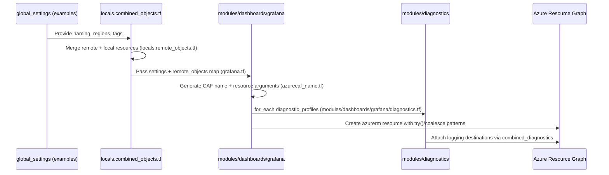

# Project Architecture Blueprint – terraform-azurerm-caf

Generated: 2025-11-14 18:29:12 UTC

## 1. Architecture Detection and Analysis

- **Technology stack**: Pure Terraform IaC targeting Azure. Root `README.md` highlights the module is published to the Terraform Registry and relies on `azurerm`, `azurecaf`, `azuread`, and supporting providers declared across `providers.tf` files.
- **Detected frameworks & tooling**: CAF naming provider (`terraform-provider-azurecaf`), Terraform CLI (1.12.x in `.github/workflows/pr_tests-scenarios.yaml`), DeepWiki/MkDocs docs pipeline (`mkdocs.yml`), and GitHub Actions for validation.
- **Architectural pattern**: A layered orchestration pattern (documented in `docs/architecture/OVERVIEW.md`) with root aggregators → service modules → numbered examples/tests. Modules follow standardized variable/locals/diagnostics/private endpoint files per `.github/instructions/terraform-modules.instructions.md`.
- **Dependency flow**: Root files (`/*.tf`) compose modules via `for_each`, marshalling dependencies through `local.combined_objects_*` maps and the `remote_objects` abstraction (`local.remote_objects.tf`). Modules in `modules/**` resolve those inputs via `coalesce` and `try()` patterns.

## 2. Architectural Overview

- The solution implements a **CAF-conformant Terraform super-module**. Layer 1 orchestrates Azure services, Layer 2 encapsulates reusable modules, Layer 3 provides executable documentation.
- **Guiding principles**: Convention over configuration (uniform file layout), explicit dependency wiring through `remote_objects`, CAF naming enforced via `azurecaf_name.tf`, ubiquitous diagnostics/private endpoint support, and reproducible examples acting as regression tests.
- **Boundaries**: Root aggregators never declare resources directly; all Azure resources live inside `modules/<category>/<service>` directories. Examples depend exclusively on published variables/outputs, reinforcing encapsulation.
- **Hybrid adaptations**: Terraform’s declarative model is combined with CAF-specific naming/diagnostics patterns and DeepWiki doc generation to keep infrastructure and documentation synchronized.

## 3. Architecture Visualization

```mermaid
flowchart LR
    subgraph Layer1[Layer 1 – Root Aggregators (/*.tf)]
        Vars[variables.tf]
        Locals[locals.tf]
        Aggregators[grafana.tf | networking_virtual_networks.tf | ...]
    end
    subgraph Layer2[Layer 2 – Modules (modules/category/service)]
        ModuleCore[service_name.tf]
        CAF[azurecaf_name.tf]
        Diag[diagnostics.tf]
        PE[private_endpoints.tf]
    end
    subgraph Layer3[Layer 3 – Examples & Tests (examples/**)]
        tfvars[100-/200-/300-level configuration.tfvars]
        Tests[examples/tests/mock]
    end
    Vars --> Locals --> Aggregators --> ModuleCore
    ModuleCore --> CAF
    ModuleCore --> Diag
    ModuleCore --> PE
    ModuleCore -->|outputs| Layer1
    Layer1 --> tfvars
    tfvars --> Tests
```



## 4. Core Architectural Components

- **Root Aggregators (`/*.tf`)**
  - _Purpose_: Group service instances (e.g., `grafana.tf`) and expose outputs.
  - _Structure_: `module` blocks with `for_each`, dependency maps, and outputs per `docs/architecture/OVERVIEW.md`.
  - _Interactions_: Consume `local.*` data, call Layer 2 modules, feed `local.combined_objects_*` for downstream dependencies.
  - _Evolution_: Add a new aggregator file plus entries in `variables.tf`, `locals.tf`, `locals.combined_objects.tf`, and corresponding workflow JSON entries.

- **Service Modules (`modules/**`)\*\*
  - _Purpose_: Define Azure resources with CAF-compliant naming, diagnostics, and connectivity (e.g., `modules/dashboards/grafana`).
  - _Internal structure_: Standard set of files (`providers.tf`, `variables.tf`, `locals.tf`, `azurecaf_name.tf`, `<service>.tf`, `diagnostics.tf`, `private_endpoints.tf`, optional submodules) enforced by `.github/instructions/terraform-modules.instructions.md`.
  - _Interactions_: Inputs from root (global settings, resource group, remote objects). Outputs feed `combined_objects` maps.
  - _Evolution_: Extend `variables.tf` and `<service>.tf` with new arguments validated via MCP Terraform; maintain compatibility through `try()` fallbacks.

- **Diagnostics Subsystem (`diagnostics.tf`, `modules/diagnostics`)**
  - _Purpose_: Centralize logging destinations (storage, Log Analytics, Event Hub) and reuse for every resource supporting diagnostics.
  - _Structure_: Local maps for `diagnostic_*` resources, modules for each destination, and combined outputs exposed via `local.combined_diagnostics`.
  - _Interactions_: Modules call `../../diagnostics` to bind resource IDs to shared profiles.
  - _Evolution_: Add new destination types by extending local maps and modules.

- **Examples/Test Harness (`examples/**`, `examples/tests/mock`)\*\*
  - _Purpose_: Provide ready-to-run scenarios and serve as automated tests.
  - _Structure_: Numbered directories with `configuration.tfvars` plus mock Terraform tests described in `examples/tests/README.md`.
  - _Interactions_: GitHub Actions iterate over `.github/workflows/standalone-scenarios.json` to execute `terraform test` per example.
  - _Evolution_: Add new example directories and register them in workflow JSON; ensures coverage of new features.

- **Documentation Pipeline (`mkdocs.yml`, DeepWiki)**
  - _Purpose_: Generate module/root docs and dependency diagrams per merge.
  - _Structure_: MkDocs navigation enumerates both module and root files, ensuring parity.
  - _Interactions_: Automation (not shown here) regenerates Markdown under `docs/` from module metadata.
  - _Evolution_: When adding modules, update DOC generator metadata to keep nav accurate.

## 5. Architectural Layers and Dependencies

- **Layering**: Root orchestrators (Layer 1) depend on modules (Layer 2) only through Terraform `module` blocks; modules have no knowledge of root files except via inputs. Layer 3 (examples/tests) depends solely on public variables/outputs.
- **Dependency rules**: `locals.tf` decomposes variables per domain; `locals.combined_objects.tf` merges outputs with remote/data sources; `local.remote_objects.tf` provides read-only maps into other landing zones. Layer 2 modules rely on `remote_objects` instead of direct resource references, avoiding cycles and enabling cross-landing-zone composition.
- **Abstractions**: `remote_objects` acts as an anti-corruption layer, normalizing IDs regardless of origin. `global_settings` centralizes naming/tagging policies.
- **Circular safeguard**: Because modules receive dependencies as plain values (IDs, objects) rather than referencing sibling modules directly, Terraform’s dependency graph stays acyclic. Root files combine outputs post-creation, so no module references another module directly.

## 6. Data Architecture

- **Domain model**: All domain data is expressed as hierarchical maps keyed by landing-zone + object key (see `locals.combined_objects.tf`). Resource metadata (IDs, names, tags) lives inside those maps for downstream consumption.
- **Entity relationships**: `resource_groups`, `vnets`, `virtual_subnets`, etc., are aggregated into `local.combined_objects_*` maps, enabling other services to look up dependencies via `remote_objects` (e.g., Grafana private endpoints referencing `var.remote_objects.virtual_subnets`).
- **Data access patterns**: Modules read settings via `var.settings`, with `try()` and `coalesce()` ensuring safe access. External references use `var.remote_objects.<collection>[lz_key][resource_key]`.
- **Transformation/mapping**: `locals.tf` per module normalizes location, tags, and resource-group names. Root-level `locals.combined_objects` merges local modules with remote landing zones and data sources for federated deployments.
- **Validation**: `azurecaf_name` enforces Azure naming constraints; Terraform `variable` blocks document expected shapes; optional arguments default via `try()` to avoid null reference errors.
- **Caching strategies**: Diagnostics destinations (`local.combined_diagnostics`) store computed references for repeated reuse without recomputing lookups.

## 7. Cross-Cutting Concerns Implementation

- **Authentication & Authorization**: `var.client_config` carries tenant/subscription context from landing zones. Identity resources (`modules/security/managed_identity`, `modules/roles/**`) manage service principals and role assignments, referenced through `remote_objects.managed_identities`.
- **Error Handling & Resilience**: Terraform-specific resilience achieved via `try()` wrappers (prevent plan failures due to missing optional settings), `coalesce()` fallbacks, and dynamic blocks guarded by `== null ? [] : [value]` patterns (see `modules/dashboards/grafana/grafana.tf`).
- **Logging & Monitoring**: Central diagnostics aggregator (`diagnostics.tf`) provisions storage, Log Analytics, and Event Hub sinks, while each module attaches diagnostic profiles via the diagnostics submodule.
- **Validation**: CAF naming provider enforces resource-specific regex/prefix constraints; module locals merge tags to include module identifiers for traceability; GitHub workflows enforce Terraform lint/test passes before merge.
- **Configuration Management**: `global_settings` defines prefixes, suffixes, tags, and region mappings; examples feed `global_settings` values. Secrets stay out of repo and are expected through variable inputs or linked services (e.g., Key Vault modules).

## 8. Service Communication Patterns

- **Service boundaries**: Each module directory encapsulates a single Azure resource type (sometimes with sub-resources). Communication occurs via Terraform data structures rather than runtime protocols.
- **Protocols & formats**: Data exchanged as Terraform maps/objects (HCL). Remote references use `lz_key` + `key` addressing to support multi-landing-zone topologies.
- **Synchronous vs. asynchronous**: Terraform evaluation remains synchronous, but diagnostics modules and remote object merges allow eventual consistency with existing infrastructure by reading from `var.remote_objects` or `var.data_sources`.
- **Versioning**: Modules rely on semantic versioning of the overall registry module; individual modules maintain backward compatibility through `try()` defaults instead of breaking interface changes.
- **Discovery mechanisms**: `local.combined_objects_*` acts as a service registry, enabling any module to look up others by key without direct dependencies.
- **Resilience**: Because resource IDs come from merged maps, consumers continue to function even if a dependency lives in another Terraform state, provided the remote state publishes matching keys.

## 9. Technology-Specific Architectural Patterns

- **Terraform & Azure Patterns**:
  - `for_each` loops in root aggregators (e.g., `grafana.tf`) scale deployments per configuration map.
  - Standardized module variables/locals/azurecaf/diagnostics files keep every service aligned.
  - Dependency resolution via `remote_objects` supports cross-state referencing without manual IDs.
  - Diagnostics and private endpoint submodules are always sourced by relative paths (`../../diagnostics`, `../../networking/private_endpoint`).
- **.NET / Java / React / Angular / Python**: Not detected in this repository; no runtime application code exists, so these subsections are intentionally empty.

## 10. Implementation Patterns

- **Interface design**: Module inputs mirror a canonical interface—`global_settings`, `client_config`, `location`, `settings`, `resource_group`, `resource_group_name`, `base_tags`, `remote_objects`, plus feature-specific maps. This implicit interface allows aggregators to treat modules uniformly.
- **Service implementation**: Modules encapsulate a single resource, using locals to compute derived properties and dynamic blocks for optional nested arguments. Long-lived services (e.g., Grafana) expose IDs/endpoints via `outputs.tf` for downstream consumption.
- **Repository implementation**: Although no data repositories exist, `local.combined_objects_*` functions as an in-memory repository mapping keys → resource objects, updated automatically after each module call.
- **Controller/API patterns**: Root aggregators behave like controllers, iterating over configuration maps and invoking modules with the correct dependencies. Outputs serve as the API surface other landing zones consume.
- **Domain model implementation**: Entities are expressed as Terraform objects keyed by logical names (e.g., `grafana.grafana1`). Business rules (naming, diagnostics, networking) are enforced through standardized locals and azurecaf resources.

## 11. Testing Architecture

- **Strategy**: Examples double as test fixtures. `examples/tests/README.md` instructs running `terraform test -test-directory=./tests/mock -var-file=...` to validate modules end-to-end.
- **Boundaries**: Tests exercise the entire stack (root → modules) using mock providers (e.g., `random_string`) to keep runs deterministic.
- **Tooling**: GitHub Actions workflow `pr_tests-scenarios.yaml` loads `.github/workflows/standalone-scenarios.json`, iterates across `examples/**/configuration.tfvars`, and runs Terraform init/test for each scenario on Ubuntu runners.
- **Data strategy**: Each example declares self-contained `global_settings`, `resource_groups`, and service maps, ensuring reproducible test data.
- **Mocking**: Terraform test harness uses `.tftest.hcl` files under `examples/tests/mock` (not shown) to stub provider behavior where needed.

## 12. Deployment Architecture

- **Topology**: Generated plans apply directly to Azure subscriptions specified in the caller’s environment. Deployments may span multiple landing zones by passing `remote_objects` populated from other states.
- **Environment adaptations**: `global_settings.regions` maps friendly names to Azure regions, allowing environment-specific overrides without altering module code. `var_folder_path` supports referencing per-environment var directories.
- **Runtime dependencies**: Requires Terraform CLI, Azure authentication (via `az login`, service principal, or managed identity), and provider plugins cached in CI.
- **Configuration management**: Examples show invoking modules via `terraform -chdir=examples test ...` and the repo references `terraform-azurerm-caf-deployments` for more complex orchestrations. No containers or Kubernetes are involved; the Terraform process orchestrates Azure resources directly.

## 13. Extension and Evolution Patterns

- **Feature addition**:
  1. Create or extend a module under `modules/<category>/<service>` following the mandated file set.
  2. Expose resource outputs and wire them into `locals.combined_objects.tf` and `local.remote_objects.tf` if cross-module references are needed.
  3. Add new examples (`examples/category/service/1xx-.../configuration.tfvars`) and register them in `.github/workflows/standalone-scenarios*.json`.
- **Modification**:
  - Use `try()` defaults to preserve backward compatibility when adding settings.
  - Deprecate inputs by maintaining legacy keys in locals until all callers migrate.
  - Document breaking changes in README/docs and update DeepWiki metadata.
- **Integration**:
  - Leverage `remote_objects` to consume resources from other landing zones or data sources rather than hardcoding IDs.
  - Build adapters via wrapper modules if an external system requires pre/post-processing before invoking CAF modules.

## 14. Architectural Pattern Examples

- **Layer separation (`grafana.tf`)**:

  ```hcl
  module "grafana" {
    source        = "./modules/dashboards/grafana"
    for_each      = local.dashboards.grafana
    client_config = local.client_config
    global_settings = local.global_settings
    resource_group = local.combined_objects_resource_groups[try(each.value.resource_group.lz_key, local.client_config.landingzone_key)][try(each.value.resource_group.key, each.value.resource_group_key)]
    remote_objects = {
      vnets           = local.combined_objects_networking
      virtual_subnets = local.combined_objects_virtual_subnets
      diagnostics     = local.combined_diagnostics
    }
  }
  ```

- **Component implementation (`modules/dashboards/grafana/grafana.tf`)**:

  ```hcl
  resource "azurerm_dashboard_grafana" "grafana" {
    name                = azurecaf_name.grafana.result
    resource_group_name = local.resource_group_name
    location            = local.location
    grafana_major_version = try(var.settings.grafana_major_version, 11)
    dynamic "identity" {
      for_each = try(var.settings.identity, null) == null ? [] : [var.settings.identity]
      content {
        type = identity.value.type
        identity_ids = contains(["userassigned", "systemassigned, userassigned"], lower(identity.value.type)) ? coalesce(
          try(identity.value.identity_ids, null),
          try([
            for key in try(identity.value.managed_identity_keys, []) :
            var.remote_objects.managed_identities[try(identity.value.lz_key, var.client_config.landingzone_key)][key].id
          ], null)
        ) : null
      }
    }
    tags = merge(local.tags, try(var.settings.tags, null))
  }
  ```

- **Extension point example (`examples/grafana/100-simple-grafana/configuration.tfvars`)**:
  ```hcl
  grafana = {
    grafana1 = {
      name                  = "grafana-test-1"
      resource_group = {
        key = "grafana_rg"
      }
      identity = {
        type = "SystemAssigned"
      }
      tags = {
        environment = "dev"
      }
    }
  }
  ```

## 15. Architectural Decision Records

1. **Three-layer structure** (`docs/architecture/OVERVIEW.md`): Adopted to scale from single modules to enterprise scenarios and to let examples function as executable docs. Alternative (single flat module) would hinder reuse; chosen pattern enables composition and automated documentation.
2. **`remote_objects` registry** (`local.remote_objects.tf`): Selected to decouple modules from each other and allow cross-landing-zone references. Alternatives like direct module references would break when dependencies live in other Terraform states.
3. **Mandatory diagnostics/private endpoint files** (`.github/instructions/terraform-modules.instructions.md`): Ensures every resource can emit telemetry and integrate privately without bespoke code, improving compliance and security posture.

## 16. Architecture Governance

- **Automated enforcement**: Path-specific Copilot instructions (`.github/instructions/*.instructions.md`) codify expectations per layer. GitHub Actions (`pr_tests-scenarios.yaml`, monthly workflows) block merges unless Terraform init/test passes for all registered scenarios.
- **Documentation governance**: MkDocs (`mkdocs.yml`) and DeepWiki regenerate module/root docs after each merge, ensuring documentation reflects code.
- **Review processes**: PR badges in `README.md` surface CI status; contributors are directed to repo wiki for standards.
- **Compliance artifacts**: Examples-as-tests plus diagnostics mandate provide traceability for audit requirements.

## 17. Blueprint for New Development

- **Workflow**:
  1. Define configuration under `examples/.../configuration.tfvars` to describe the feature.
  2. Add/extend module(s) under `modules/<category>/<service>` following standard files and CAF naming.
  3. Wire aggregator entries (`variables.tf`, `locals.tf`, `locals.combined_objects.tf`, root `<service>.tf`) and register new examples in `.github/workflows/*scenarios*.json`.
  4. Run `terraform -chdir=examples test ...` per `examples/tests/README.md` before submitting a PR.
- **Implementation templates**: Reuse existing module scaffolding (providers/variables/locals/azurecaf/diagnostics/private_endpoints/outputs). Diagnostics and private endpoints always source `../../diagnostics` and `../../networking/private_endpoint` respectively.
- **Common pitfalls**: Forgetting to merge outputs into `local.combined_objects_*` (breaks downstream lookups), skipping example/test updates (CI failure), or hardcoding Azure prefixes already added by azurecaf (name-length violations). Keep `remote_objects` keys consistent (lz_key + key) to avoid lookup errors.
- **Currency**: This blueprint reflects repository state as of 2025-11-14 18:29:12 UTC. Re-run the architecture blueprint workflow whenever new modules, workflows, or documentation conventions are introduced to keep guidance current.
