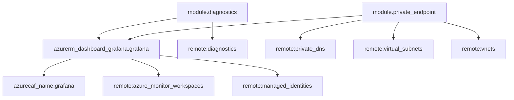

# monitoring/grafana

## Overview
This page documents the Terraform module implementation, key configuration surfaces, and how it integrates with CAF.

## Dependency diagram (Mermaid)

## Module Reference
**Category**: monitoring  
**Path**: `modules/monitoring/grafana`  
**Azure Resources**: `azurecaf_name`, `azurerm_dashboard_grafana`

### Inputs

| Name | Description | Type | Required | Default | Validation |
|------|-------------|------|:--------:|---------|------------|
| `global_settings` | Global settings for naming conventions and tags. | `any` | yes | `-` | - |
| `client_config` | Client configuration for Azure authentication and landing zone key. | `any` | yes | `-` | - |
| `location` | Azure location where the resource will be created. | `string` | yes | `-` | - |
| `settings` | Configuration settings for the resource. | `any` | yes | `-` | - |
| `resource_group` | Resource group object (provides name and location). | `any` | yes | `-` | - |
| `resource_group_name` | Resource group name (optional, overrides resource_group.name). | `string` | no | `-` | - |
| `base_tags` | Flag to determine if tags should be inherited. | `bool` | yes | `-` | - |
| `remote_objects` | Remote objects for cross-module dependencies (diagnostics, vnets, virtual_subnets, private_dns, managed_identities, a... | `any` | no | `{}` | - |
| `private_endpoints` | Map of private endpoint configurations for Azure Managed Grafana. | `any` | no | `{}` | - |

### Outputs

| Name | Description | Sensitive | Value |
|------|-------------|-----------|-------|
| `id` | The ID of the Azure Managed Grafana instance. | - | `azurerm_dashboard_grafana.grafana.id` |
| `name` | The name of the Azure Managed Grafana instance. | - | `azurerm_dashboard_grafana.grafana.name` |
| `location` | The Azure location of the Azure Managed Grafana instance. | - | `azurerm_dashboard_grafana.grafana.location` |
| `resource_group_name` | The resource group name of the Azure Managed Grafana instance. | - | `azurerm_dashboard_grafana.grafana.resource_group_name` |
| `endpoint` | The endpoint URL of the Grafana instance. | - | `azurerm_dashboard_grafana.grafana.endpoint` |
| `grafana_version` | The full Grafana software semantic version deployed. | - | `azurerm_dashboard_grafana.grafana.grafana_version` |
| `grafana_major_version` | The major version of Grafana deployed. | - | `azurerm_dashboard_grafana.grafana.grafana_major_version` |
| `outbound_ip` | List of outbound IPs if deterministic outbound IP is enabled. | - | `try(azurerm_dashboard_grafana.grafana.outbound_ip, [])` |
| `identity` | Identity block with principal_id and tenant_id. | - | `try(azurerm_dashboard_grafana.grafana.identity, null)` |
| `sku` | The SKU of the Grafana instance. | - | `azurerm_dashboard_grafana.grafana.sku` |
| `rbac_object_id` | The principal ID for RBAC assignments (if identity is enabled). | - | `try(azurerm_dashboard_grafana.grafana.identity[0].principal_id, null)` |

## Sources
- `modules/monitoring/grafana/azurecaf_name.tf`
- `modules/monitoring/grafana/diagnostics.tf`
- `modules/monitoring/grafana/grafana.tf`
- `modules/monitoring/grafana/locals.tf`
- `modules/monitoring/grafana/module.tf`
- `modules/monitoring/grafana/outputs.tf`
- `modules/monitoring/grafana/private_endpoints.tf`
- `modules/monitoring/grafana/providers.tf`
- `modules/monitoring/grafana/variables.tf`
